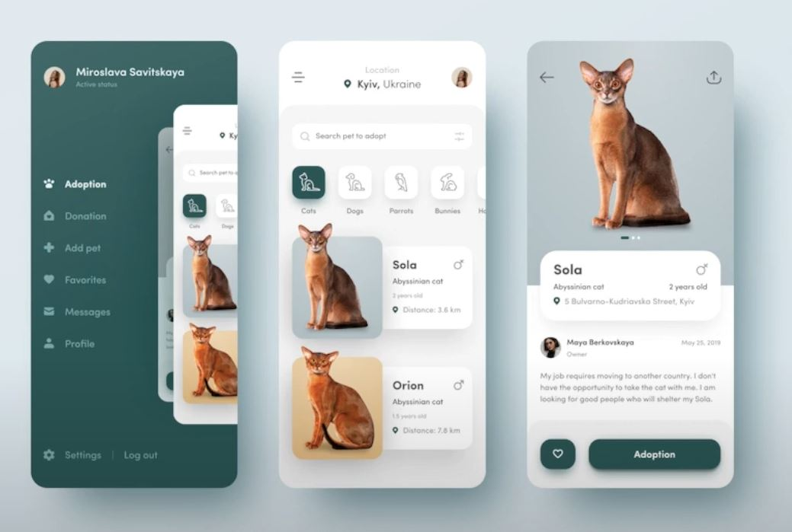

# HiddenDrawer

I build flutter ui using very simple techniques and widgets.Drawer can incredibly improve the UI of any mobile application. 
Flutter has made it possible for developers to make crisp UI and has been a hot topic between the developers to make Flutter application.

- In this design, you will see how the common UI layouts are created and how hero animations take place. In addition to this, you will also see how you can customize the transition between screen switching. 

## Project Specifications

1.  The hidden drawer 
2.  Make images pop out from the screen.
3.  The UI for description screen.
4.  not only navigate simply to the detail screen but also add a cool animation to it.

## Screenshot

